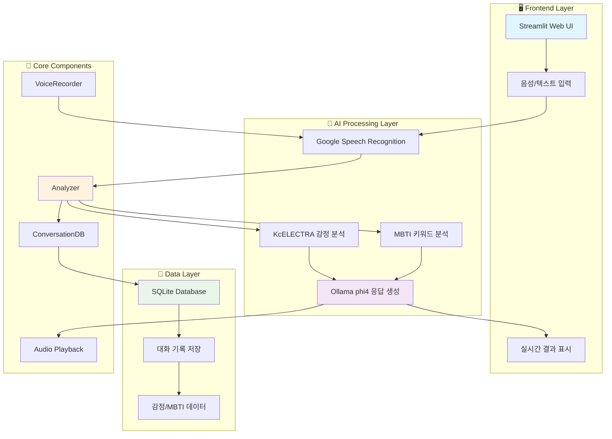
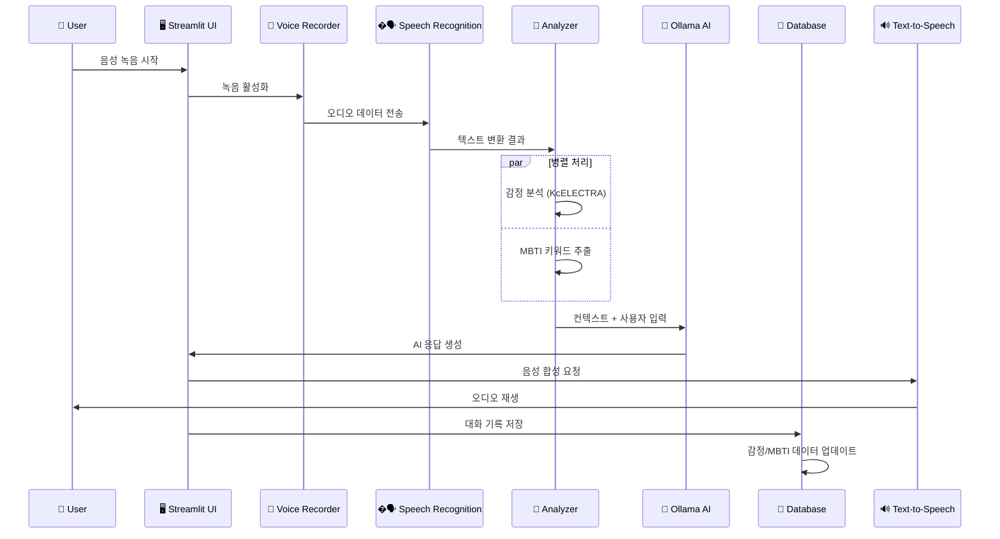
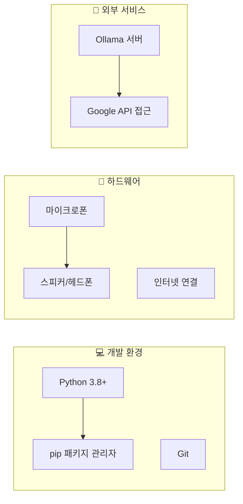
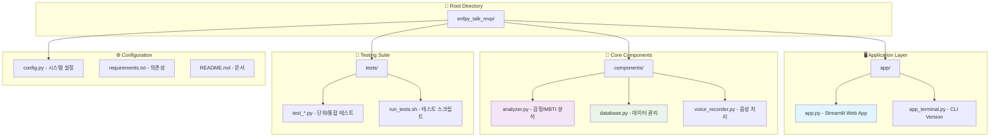
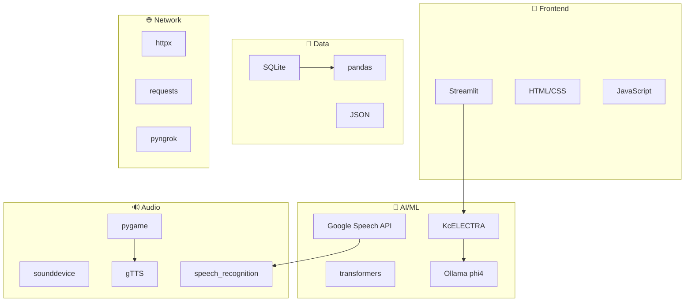
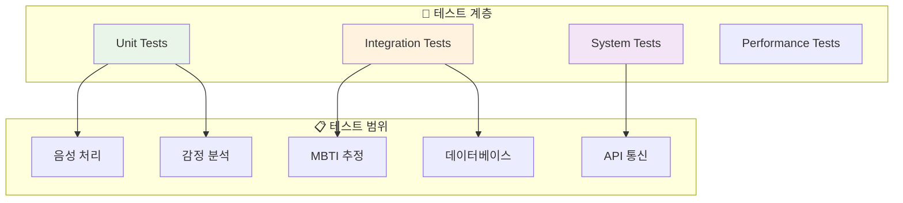

# 🎙️ ENFP AI Voice Chatbot

> **AI 기반 한국어 음성 대화 시스템** - 감정 분석, MBTI 추정, 지능형 응답 생성

[](https://python.org)
[](https://streamlit.io)
[](LICENSE)


AI 기반 음성 대화 시스템으로 한국어 감정 분석과 MBTI 성격 유형 추정 기능을 제공합니다. 
실시간 음성 인식, 자연어 처리, 그리고 개인화된 AI 응답을 통해 사용자와 대화를 나눕니다.
NBTI 분석을 넣다 말았는데 이유는 대화 음성톤을 자연스럽게 조절 하려는 목적이였지만 로컬에서는 느려서 단순한 단어 위주로만 적용한 상태입니다. 
빠른 처리를 위해서는 word2vec 거리값만으로도 유사도 평가로 감정분류를 해도 좋을것 같습니다.

## 📸 스크린샷


*메인 웹 인터페이스 - 음성/텍스트 입력, 실시간 감정 분석, AI 응답 생성*

---

## 🎯 프로젝트 개요

### 📋 핵심 목표
- **실시간 한국어 음성 대화**: Google Speech Recognition 기반 정확한 음성-텍스트 변환
- **감정 인식**: KcELECTRA 모델을 활용한 고정밀도 한국어 감정 분석
- **성격 분석**: 대화 내용 기반 MBTI 성격 유형 추정
- **지능형 응답**: Ollama phi4 모델로 자연스럽고 개인화된 대화 생성
- **데이터 지속성**: 완전한 대화 기록 관리 및 분석

### 🏗️ 시스템 아키텍처



### � 대화 플로우



---

## ✨ 주요 기능

### 🎤 **음성 처리**
- **실시간 음성 인식**: Google Speech Recognition API
- **음성 합성**: gTTS (Google Text-to-Speech) 
- **오디오 재생**: pygame 기반 크로스플랫폼 지원
- **듀얼 입력**: 음성 + 텍스트 입력 동시 지원

### 🧠 **AI 분석**
- **감정 분석**: KcELECTRA 한국어 특화 모델
  - 긍정, 부정, 중성 감정 분류
  - 실시간 감정 상태 추적
- **MBTI 성격 분석**: 키워드 기반 성격 유형 추정
  - 16가지 MBTI 유형 분석
  - 대화 패턴 기반 성격 추론
- **대화 컨텍스트**: 이전 대화 기록 활용 개인화

### 🤖 **AI 응답 생성**
- **Ollama phi4**: 최신 LLM 모델 활용
- **개인화**: 감정 상태 및 MBTI 반영 응답
- **자연스러운 대화**: 한국어 특화 프롬프트 엔지니어링

### 💾 **데이터 관리**
- **SQLite 데이터베이스**: 경량화된 로컬 저장소
- **대화 기록**: 전체 세션 이력 보존
- **분석 데이터**: 감정/MBTI 추이 추적
- **내보내기**: JSON 형태 데이터 백업

---

## 🚀 빠른 시작

### 📋 시스템 요구사항



### 1. 📥 저장소 클론 및 설정

```bash
# 저장소 클론
git clone <repository-url>
cd enfpy_talk_mvp

# 가상 환경 생성 (권장)
python -m venv venv
source venv/bin/activate  # Windows: venv\Scripts\activate

# 의존성 설치
pip install -r requirements.txt
```

### 2. 🔧 Ollama 설정

```bash
# Ollama 설치 (macOS)
brew install ollama

# phi4 모델 다운로드
ollama pull phi4

# Ollama 서버 시작
ollama serve
```

### 3. 🚀 애플리케이션 실행

#### **🌐 웹 버전 (권장)**
```bash
streamlit run app/app.py
```
- **로컬 접속**: http://localhost:8501
- **네트워크 접속**: http://[IP]:8501

#### **💻 터미널 버전**
```bash
python app/app_terminal.py
```

### 4. ✅ 테스트 실행

```bash
# 전체 테스트 실행
./run_tests.sh

# 개별 테스트
python tests/test_core_functions.py
python tests/test_integration.py
```

---

## 📁 프로젝트 구조



### 📋 디렉토리 상세 설명

| 디렉토리/파일 | 역할 | 주요 기능 |
|---------------|------|-----------|
| `app/app.py` | 메인 웹 애플리케이션 | Streamlit UI, 사용자 인터페이스 |
| `app/app_terminal.py` | CLI 버전 | 터미널 기반 간단한 대화 |
| `components/analyzer.py` | AI 분석 엔진 | 감정 분석, MBTI 추정 |
| `components/database.py` | 데이터 관리자 | SQLite 조작, 대화 기록 |
| `components/voice_recorder.py` | 음성 처리기 | 음성 녹음, 전처리 |
| `tests/` | 테스트 모음 | 단위 테스트, 통합 테스트 |
| `config.py` | 설정 파일 | API 설정, 시스템 파라미터 |

---

## ⚙️ 설정 및 커스터마이징

### 🔧 config.py 설정 옵션

```python
# Ollama API 설정
OLLAMA_BASE_URL = "http://localhost:11434"
OLLAMA_MODEL = "phi4"

# 음성 녹음 설정
VOICE_DURATION = 5  # 녹음 시간 (초)
VOICE_SAMPLE_RATE = 44100  # 샘플링 레이트
VOICE_CHANNELS = 1  # 모노/스테레오

# 데이터베이스 설정
DB_PATH = "conversations.db"

# Ngrok 설정 (선택적)
NGROK_PORT = 8501
ENABLE_NGROK = False  # 외부 접근 허용
```

### 🎯 MBTI 키워드 커스터마이징

```python
# analyzer.py에서 MBTI 키워드 수정 가능
MBTI_KEYWORDS = {
    "E": ["사람들", "모임", "파티", "활발한"],  # 외향성
    "I": ["혼자", "조용한", "생각", "깊이"],    # 내향성
    "S": ["현실적", "구체적", "세부사항"],      # 감각형
    "N": ["창의적", "아이디어", "상상"],       # 직관형
    # ... 더 많은 키워드 추가 가능
}
```

---

## 🔍 기술 스택 및 아키텍처

### 🛠️ 핵심 기술 스택



### 📊 성능 지표

| 컴포넌트 | 응답 시간 | 정확도 | 메모리 사용량 |
|----------|-----------|--------|---------------|
| 음성 인식 | ~2-3초 | >95% | ~50MB |
| 감정 분석 | <1초 | ~90% | ~200MB |
| AI 응답 | 3-5초 | - | ~1GB |
| MBTI 추정 | <0.5초 | ~80% | ~10MB |

---

## 📝 사용법 가이드

### 🎤 기본 대화 흐름

1. **웹 애플리케이션 접속**
   - 브라우저에서 http://localhost:8501 접속
   
2. **음성 대화 시작**
   ```
   🎤 "녹음 시작" 버튼 클릭
   → 5초간 음성 입력
   → 자동 텍스트 변환
   → AI 분석 및 응답
   → 음성 재생 (선택적)
   ```

3. **텍스트 대화 (대안)**
   ```
   💬 텍스트 입력 창에 메시지 작성
   → "전송" 버튼 클릭
   → 즉시 AI 분석 및 응답
   ```

### 🎛️ 고급 기능 활용

#### **🔊 음성 설정**
- 사이드바에서 "음성 출력 활성화" 체크박스
- 자동 재생 vs 수동 재생 선택

#### **📊 분석 결과 확인**
- 감정 분석: 실시간 감정 상태 표시
- MBTI 분석: 대화 종료 후 "MBTI 분석" 버튼

#### **📄 데이터 내보내기**
- 사이드바 "대화 기록 내보내기"
- JSON 형태로 전체 세션 데이터 다운로드

---

## 🧪 테스트 및 품질 관리

### 🔬 테스트 구조



### 🏃‍♂️ 테스트 실행 명령어

```bash
# 전체 테스트 실행
./run_tests.sh

# 특정 모듈 테스트
python -m pytest tests/test_analyzer.py -v
python -m pytest tests/test_database.py -v

# 커버리지 리포트
python -m pytest --cov=components tests/
```

---


## 🎉 즐거운 대화하세요!

> 🌟 **팁**: 자연스럽게 대화하세요! AI가 당신의 감정과 성격을 이해하고 그에 맞는 응답을 생성합니다.


### 📜 라이선스

MIT License - 자유롭게 사용하고 수정하세요!

---

## 📞 문의하기

**개발 관련 컨설팅 및 외주 받습니다.**

### 👨‍💼 프로젝트 관리자 연락처

**Email**: [hyun.lim@okkorea.net](mailto:hyun.lim@okkorea.net)  
**Homepage**: [https://www.okkorea.net](https://www.okkorea.net)

### 🛠️ 전문 분야

- **IoT 시스템 설계 및 개발**
- **임베디드 소프트웨어 개발** (Arduino, ESP32)
- **AI 서비스 개발** (LLM, MCP Agent)
- **클라우드 서비스 구축** (Google Cloud Platform)
- **하드웨어 프로토타이핑**

### 💼 서비스

- **기술 컨설팅**: IoT 프로젝트 기획 및 설계 자문
- **개발 외주**: 펌웨어부터 클라우드까지 Full-stack 개발
- **교육 서비스**: 임베디드/IoT 개발 교육 및 멘토링

---

*마지막 업데이트: 2025년 11월 11일*
